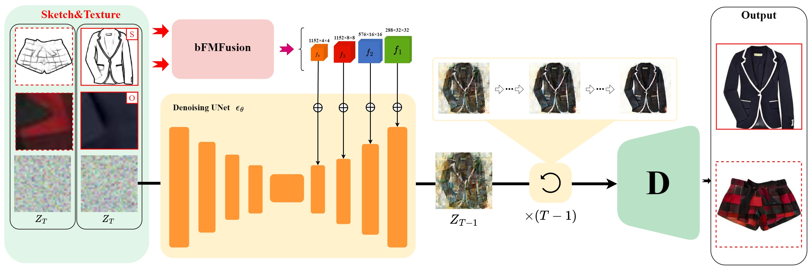

# BF-Fashion

# 1.Dataset

Download the [Cleaned Type-aware Dataset](https://github.com/AemikaChow/AiDLab-fAshIon-Data/blob/main/Datasets/cleaned-type.md) and 
and apply [HED](https://github.com/s9xie/hed) to generate sketches.

# 2.Environment

- python 3.8.5
- pytorch 1.8.1
- torchvision 0.9.1
- pytorch-lightning 1.4.2

download https://ommer-lab.com/files/latent-diffusion/vq-f8.zip and unzip it to the "models\first_stage_models\vq-f8"

# 3.Train

```sh
sh run_train.sh
```

# 4.Inference

```sh
sh run_batch_sample.sh
```

# 5.Evaluation

```sh
python m_class_fid_lpips.py
python m_class_histo_loss.py
```

